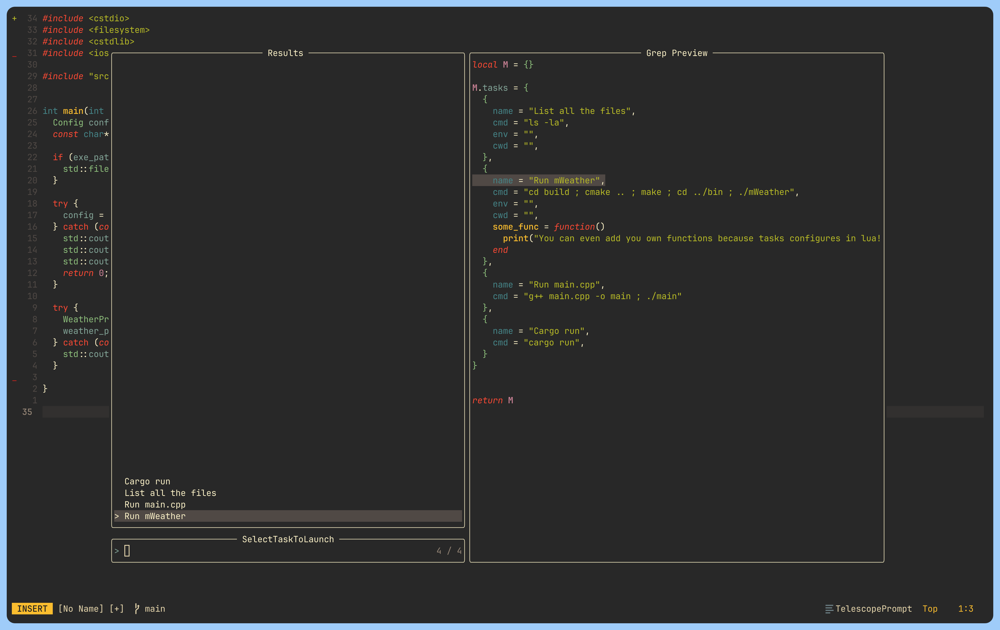

# 🥷 Terminal-and-tasks 

🔥  Intuitive, minimalistic tasks launcher with integration with Telescope and built-in terminal enhancement!




## ✨ Features
- 🔭 Create tasks in lua. Pick them using Telescope and launch in the terminal
- 📺 Task preview in telescope
- 🤖 Tasks auto update (auto resource)
- ⚡️ Built-in Neovim terminal improvements (Toggle the last openned terminal)
- 🌎 Define local and global tasks
- 👻 Reuse global tasks as template for local tasks


## 📦 Installation
Install the plugin using lazy.nvim plugin manager:

```lua
 {
     "miron2363/terminal-and-tasks",
     lazy = true,
     keys = {
         { "<C-t>",     function() require("terminal-and-tasks.terminal_tweaks").toggle_last_openned_terminal() end, mode = { "n", "t" } },
         { "<leader>r", function() require("terminal-and-tasks.telescope_tasks").tasks_picker() end },
         { "<leader>R", function() require("terminal-and-tasks.telescope_tasks").run_last_runned_task() end },
         { "<leader><leader>", function() require('telescope.builtin').buffers({path_display = {'tail'}, sort_mru = true, ignore_current_buffer = true}) end}
     },
     opts = {},
 }

 -- You also need telescope to be installed
```


## 🚀 Usage
### 1. How to create global tasks
1. To define your own tasks, you need to create "tasks" folder inside your user configuration directory in the "lua" folder.  
2. Then, you can create lua files what must return lua table with field "tasks", where your own tasks should be defined.
3. Global tasks will be available everywhere
4. File loads and updates recursively. You can create other folders in "tasks" directory and create lua files with tasks there!

```lua
-- ~/user/.config/nvim/lua/tasks/some_tasks.lua 
local M = {}

M.tasks = {
  {
    name = "List all the files and print hello",
    cmd = "ls -la ; echo $greeting",
    env = {greeting = "Hello"},
    cwd = "",
  },
}

return M

```

### 2. How to launch tasks
1. After you define your tasks, press "leader + r".
2. This will open the Telescope picker where you can select the desired task and launch it by pressing "Enter".

### 3. I started the task. What's next?
1. While a task is running and hasn't completed yet, you can hide terminal (opened on launch in new tab) using "ctrl + t". (You can reopen this terminal by pressing "ctrl + t" again)
2. Then, you can press "leader + r" again, pick a new task and launch. You can hide the terminal with the task using ctrl + t.
3. In the same way you can launch how many tasks as you want!
4. If you want to open one of these opened and then hidden terminals, you can press "leader + leader", select the desired terminal and press "ctrl + t"
5. If you want to CLOSE (not hide) the terminal, just type "exit" in the shell or press "ctrl + d" (it works in bash)

### 4. How to change tasks
1. Open the Telescope tasks picker (press "leader + r") and select the desired task.      
2. Now you can press "ctrl + t" to open a buffer with the task in a new tab and edit it
3. When you open Telescope tasks picker again, your tasks will be updated, and you will receive a correspionding notification about that


*Tabs? Buffers? Windows? Wtf is that? If so, it is highly recommended to read [this](https://betterprogramming.pub/50-vim-mode-tips-for-ide-users-f7b525a794b3#:~:text=colorless%20diff%20command.-,67.%20Vim%20tabs,-It%20must%20be) (section 67) and watch [this](https://www.youtube.com/watch?v=_6OqJrdbfs0&t=221s) video*

### 5. How to create local tasks?
1. You can also create tasks locally for your working directory. Just create a folder named "tasks" and add lua files with tasks as usual
2. If the local task has the same name as global task, then the local task will override the global task (task from local directory will be used)

### 6. What is the "Reuse as Template" functionality?
1. This feature allows you to quickly and conveniently create local tasks in your working directory based on global tasks
2. Open the Telescope tasks picker, select the task you want to reuse, and press "ctrl + r". This will clone the file containing this task into your local tasks folder (or create it if it doesn't exist yet) and open it in a new buffer
3. You can edit this newly cloned file, add new tasks. When you open tasks picker again, all tasks from this file will be loaded!


## ⚙️ Configuration
You can check the default configuration [here](./lua/terminal-and-tasks/config.lua). To override default options, simply pass new values in the opts table
```lua
opts = {
    folder_name_with_tasks = "MyTasks",
    disable_resource_messages = true,
}
```


## ❔ Explanation
What this plugin does and why is it called like that?   
IN PROGRESS...

